# ProPower Dual Channel Monitor

A multiple-channel power monitoring system based on INA226 + STM32, with a Qt/C++ desktop oscilloscope for real-time visualization, analysis, and data logging.

The project is designed with a clear data pipeline and extensible architecture, making it suitable for laboratory measurement, power electronics debugging, embedded development, and future USB-based instrumentation.

---

## Features at a Glance

- Multiple-channel Voltage / Current / Power measurement
- Real-time oscilloscope-style waveform display

- Independent channel visualization

- Mouse wheel zoom & history scrolling

- Automatic serial port detection

- CSV export for offline analysis

- Architecture ready for USB CDC & binary protocol upgrade

---

## System Architecture
### Overall Architecture


### End-to-End Data Flow
```
INA226 → I²C → STM32 → UART (Text Frame)
      → Qt Transport → Parser → Buffer
      → UI Rendering → CSV Export
```

---

## Why This Design

This project follows a layered instrumentation design philosophy:

- **Measurement layer** (INA226) focuses on accuracy and noise immunity
- **Control layer** (STM32) ensures deterministic sampling and framing
- **Presentation layer** (Qt PC App) handles parsing, visualization, and storage

The current implementation uses text-based UART frames to maximize debuggability during early development.
Internally, however, the software is structured so that:

- UART can be replaced by USB CDC without touching the UI

- Text frames can be replaced by binary frames by changing only the parser

- Plotting and buffering logic remains completely unchanged

This makes the system easy to iterate now and scalable later.

------

## Communication Protocol (Current Implementation)

The MCU sends one line per channel every ~50 ms.

*Example Output*
```
CH:1 V=12.345 V | I=0.6789 A | P=8.3700 W
CH:2 V=12.331 V | I=0.1200 A | P=1.4797 W
```

*Notes* 

- `CH:1 / CH:2` identify the channel

- Units are included for readability

- The PC application internally converts:

    - `A → mA`

    - `W → mW`

---

## Planned Binary Frame Protocol (Future)

To improve throughput, robustness, and extensibility, the system reserves support for a binary protocol.

*Proposed Frame Format*
```c
#pragma pack(push, 1)
struct PowerFrame {
    uint16_t header;      // 0xAA55
    uint8_t  channel;     // 1 or 2
    uint32_t timestamp;   // ms or us
    float    voltage;     // V
    float    current;     // mA
    float    power;       // mW
    uint16_t crc16;
};
#pragma pack(pop)
```
### Design Benefits

- No string parsing overhead

- Higher throughput and lower latency

Built-in resynchronization using header

- Natural support for CRC, timestamps, and future fields

Only the Parser layer needs to change when switching to binary frames.

---

## Software Architecture (PC Side)
### Data Pipeline Design

```mermaid
flowchart LR
    Transport[Transport<br/>UART / USB CDC]
    Parser[Parser<br/>Text / Binary]
    Buffer[Ring Buffer<br/>CH1 / CH2]
    UI[UI Layer<br/>Dashboard · Scope · CSV]

    Transport --> Parser
    Parser --> Buffer
    Buffer --> UI
```

### Responsibilities
#### Transport Layer

- Byte-level communication

- UART or USB CDC

- Handles fragmentation and stream continuity

#### Parser Layer

- Converts byte stream into structured samples

- Validates frames (regex / header / CRC)

- Emits `{channel, V, I, P}` samples

#### Buffer Layer

- Channel-separated data buffers

- Fixed-size history management

- Supplies data for plotting and export

#### UI Layer

- Numeric dashboard

- Oscilloscope widgets

- History navigation

- CSV export

### Module Breakdown
#### MCU Firmware (STM32 + INA226)

- Dual INA226 sensors over I²C

- Continuous conversion with averaging

- Physical units calculated on MCU

- Periodic UART transmission

### Qt PC Application

#### MainWindow

- Serial port management

- Device connection lifecycle

- Data buffering & CSV export

#### Oscilloscope Widget

- Grid-based waveform rendering

- Auto-ranging per visible window

- Mouse wheel zoom (time axis)

- Mu
lti-trace (V / I / P)

### CSV Export

Exports aligned channel history:
```sql
Index,CH1_V,CH1_I,CH1_P,CH2_V,CH2_I,CH2_P
```

- User-defined save path

- Compatible with Excel, MATLAB, Python

- Suitable for post-analysis and reporting

----

## Build & Run
### Requirements

- Qt 5.15+ or Qt 6.x

- C++17

- Serial device (UART or USB CDC)

- UART configuration: **115200, 8N1**

---

## Performance Considerations

Current implementation favors clarity and correctness.

For higher performance:

- Limit UI refresh rate to ~20–30 Hz

- Avoid per-sample vector.erase(begin)

- Avoid high-frequency QTextEdit::append

- Move serial I/O and parsing into a worker thread

- These optimizations prepare the system for USB CDC and binary protocol migration.

---

### Roadmap

- ✅ UART text protocol

- 🔜 Serial worker thread + data pipeline

- q 🔜 Binary frame protocol (CRC + timestamp)

- 🔜 USB CDC support

-  🔜 Recording & playback mode

### Toolchain

- MCU: STM32CubeIDE / Keil / IAR

- PC: Qt Creator + Qt Widgets + C++17

- Debug: SSCOM / TeraTerm / Logic Analyzer